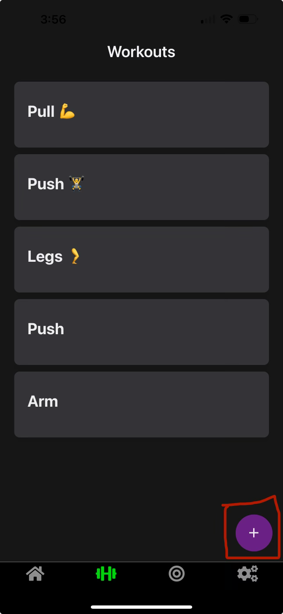
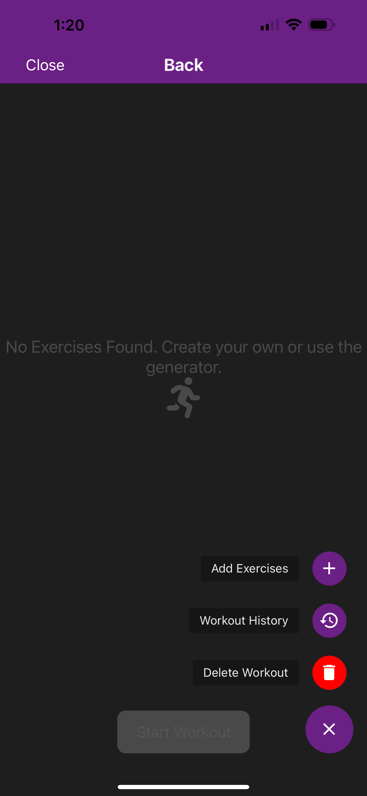

# FAQ's

#### How do we create a workout?

After navigating to the workout tab located on the Navigation bar on the bottom of the screen. Their should be a circle icon with a + on the bottom right hand side.

You will then be prompted to give the workout a name and select days that youll like to perform these workouts.

After youll then have a workout with your desired name and days. From here you can now add exercises to the workout by selecting the bottom right icon.

From here you can delete the workout, and add exercised by either selecting your own exercises to create your own desired workout or use FIT AI to help guide you by creating a list of exercises for you based on what you tell FIT AI.

#### How does the AI workout generator work?

FIT AI uses the power of OpenAI's gpt 3.5 turbo. It uses the information we give it and returns a tailored list of exercises. It is up to you to add the exercises you want. If you don't get the results you're looking for, redo the survey and add some more context.

#### Why do my generated exercises not show up on my workout?

The exercises are generated but still need to be added to your workout. Make sure you swipe over and press the add button. They should be outlined in green.

#### Why does the app need personal information?

Our app is made to tailor workouts to you. Our AI generation works best with as much information as possible. Things like height and weight can help to tailor an exercise to you. These fields are entirely optional.

#### Why do some things take a while to load?

Our app is optimal, through performance tests we can manage about 2000 users before running into issues. However at the moment our backend is hosted using a free service. This means that at times the backend is temporarily set to spin down. If you notice a long load time or an api call timing out, try the action again. Most likely the backend service is booting up for use.

# Troubleshooting

## Web Version

- Refreshing the page leads me to a broken link.

  This app is built for running natively on android and iOS. We have created the web version to facilitate an easy to use Beta that requires no installs or technical skills. With that there are some known issues. The biggest one is refreshing. The built in refresh in the browser leads to some routes not working. This is expected. Just click the back to our site link to be redirected. Sign in again, and avoid refreshing when possible.

## Expo Emulator
