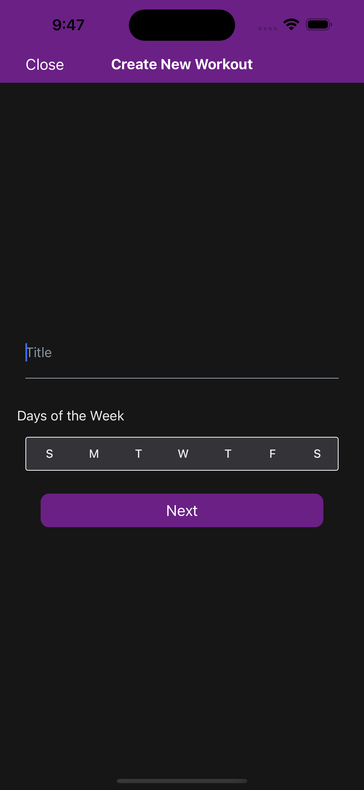
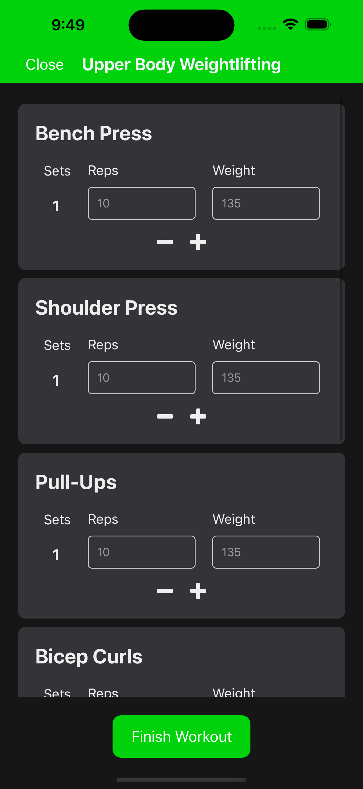

# User Guide

## Getting Started

Start by signing up for an account on the app. Once you have an account, you can log in and start using the app to create and track your workouts, set fitness goals, and monitor your progress.

Feel free to use any email you would like. At the moment we are using a test database so the data will be dropped. Any email will work, including fake emails. In the future we will verify emails and implement password recovery.

  

    
  

  

    
  

  

    
  

## Navigation

### Home:

On the Home Page the user will be presented with Today's Workout which is given based on what the user selected when creating a workout. The User can click a workout which will then display the exercise of the workout along with the ability to start the workout and track it.

### Workouts:

Navigate to the workouts tab to create workouts and view your workout history.

Start by creating a workout:

  

    
  

  

    
  

  

    
  

From there you can navigate to the workout and create some exercises

  

    
  

  

    
  

- #### FIT AI Generator
  Select the FIT AI generation to generate a few exercises to add to your workout. Fill out the form, then add the exercises you would like to your workout.
   

      

        
      

      

        
      

      

        
      

      

         
      

   

From there you can start a workout session to track your progress during a workout.

   

      

        
      

      

        
      

   

### Goals:

  

    
  

  

    
  

The Goals page allows you to manage different types of goals within the app, including Progress Goals (PR), and Completed Goals. Follow these steps to effectively use the Goals page:

1. **Navigation**:

   - Upon accessing the Goals page, you'll see a tabbed interface at the top, allowing you to switch between different types of goals.
   - Each tab represents a different category of goals: "Progress" for PR goals, and "Completed" for achieved goals.

2. **Viewing Goals**:

   - Tap on each tab to view the respective goals under that category.
   - The goals will be displayed as cards, showing relevant information such as the goal title and progress.

3. **Adding Goals**:

   - If there are no goals listed under a particular category, you'll see a prompt indicating this.
   - To add a new goal, tap the "+" button located at the bottom right corner of the screen.
   - This will navigate you to the goal creation page, where you can input details for your new goal.

4. **Navigation**:
   - You can navigate back to the Goals page from the goal creation page or any other linked page using the device's back button or any navigation controls on the lower tab bar.

### Settings:

The settings page allows the user to view and modify information pertaining to their account profile, as well as log out of their account. Fields that can be updated are signified with a chevron on the right side, and can be selected to open up a new menu to fill out the new information:

1. **Name**:

   - The user can set their first and last name by entering it into the respective field and then selecting 'Save'.
   - The user can cancel changing their first and/or last name by selecting 'Cancel'.

2. **Gender**:

   - The user can select their gender by pressing the box of gender that corresponds to theirs, and then selecting 'Save'.
   - The user can cancel changing their gender by selecting 'Cancel'.

3. **Weight**:

   - The user can change their weight by entering a numeric weight value (in pounds) in the weight field, and then selecting 'Save'.
   - The user can cancel changing their weight by selecting 'Cancel'.

4. **Height**:
   - The user can change their height by entering a numeric height value in the feet and inch fields, and then selecting 'Save'.
   - The user can cancel changing their height by selecting 'Cancel'.

## Basic Tasks

### Creating a Goal

To create a new goal in the app, follow these steps:

1. **Access the Goal Creation Page**:

   - Navigate to the goals tab (indicated by the target icon) and click on the "+" button in the bottom right of the "Progress Goals" tab.

2. **Select an Exercise**:

   - The first step is to choose an exercise for which you want to set a goal. This is done by selecting an exercise from the provided dropdown menu labeled "Exercise".
   - If the "Exercise" picker is empty, it means you haven't saved any exercises yet.
   - A PR (Personal Record) goal can only be created if you've generated a workout with exercises in it. If you haven't done so, navigate to the "Workout" tab and create a workout first.

3. **Choose Goal Options**:

   - After selecting the exercise, you'll need to choose the type of goal you want to set. This is done through the "Goal Options" dropdown menu.
   - You can choose from options like "Reps", "Weight", "Duration (mins)", or "Distance (miles)" depending on your preference and the nature of your fitness goal.

4. **Enter Goal Details**:

   - Once you've selected the exercise and the type of goal, you need to specify the desired goal amount. This is done by entering a numerical value in the input field labeled "Goal".
   - Make sure to enter a valid number for the goal.

5. **Submit the Goal**:

   - After entering all the required details, click on the "Next" button to submit the goal.
   - The app will validate the information and create the goal accordingly.

6. **Confirmation**:
   - Once the goal is successfully created, you'll receive a confirmation message indicating that the goal creation was successful.
   - If there are any issues during the creation process, you'll be notified of the error.
